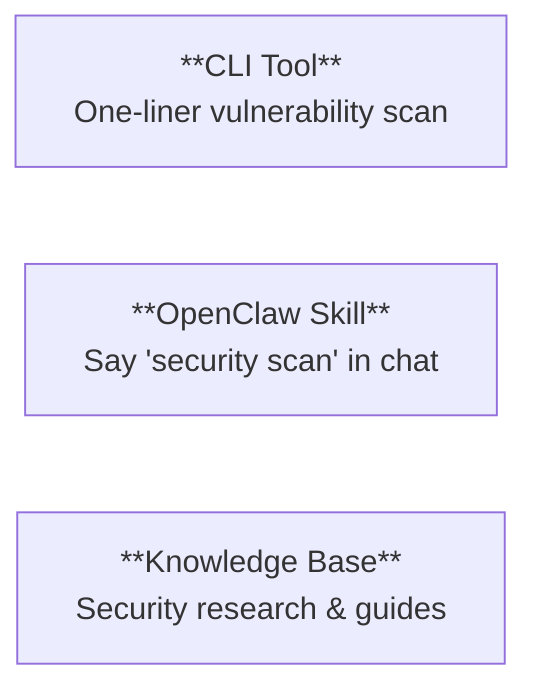

**English** | [日本語](README.ja.md)

# AuditClaw

A security audit toolkit for [OpenClaw](https://github.com/openclaw/openclaw). Scan for known vulnerabilities, check runtime configuration, and get actionable remediation steps.

## What You Get



## 1. Quick Scan (CLI)

No install required. Run this and get a Markdown security report:

```bash
curl -sL https://raw.githubusercontent.com/natsuki/auditclaw/main/skill-dist/auditclaw-scan/scan.sh | bash
```

Auto-detects your OpenClaw version. To scan a specific version:

```bash
curl -sL https://raw.githubusercontent.com/natsuki/auditclaw/main/skill-dist/auditclaw-scan/scan.sh | bash -s 2026.2.10
```

**What it checks:**
- 30+ known GHSA/CVE vulnerabilities mapped by version (CalVer)
- 6 runtime configuration items (sandbox, Gateway auth, exec allowlist, etc.)
- Permanent warnings (prompt injection, DM pairing)

## 2. OpenClaw Skill

Embed as a self-diagnostic skill inside OpenClaw. Once installed, just say "security scan" in chat.

```bash
cp -r skill-dist/auditclaw-scan /path/to/openclaw/skills/
```

The skill runs a full 6-phase scan: version detection, DB retrieval, vulnerability matching, config check, report generation, and action plan.

Details: [Skill Usage Guide](docs/en/skill/README.md)

## 3. Knowledge Base

Security research organized as a [GitBook](https://gitbook.io):

- [Vulnerability Cases](docs/en/vulnerabilities/README.md) - Prompt injection, sandbox escape, auth bypass, etc.
- [Update Information](docs/en/updates/README.md) - Version history and security milestones
- [Best Practices](docs/en/best-practices/README.md) - OWASP-based setup and hardening guides
- [Security Setup Guide](docs/en/best-practices/setup-guide.md) - Where to install, directory risks, secure configuration

## FAQ

**Does this tool access my code or secrets?**
No. It only reads its own vulnerability database and OpenClaw's version/config output. [Details](docs/en/best-practices/setup-guide.md#what-data-does-this-skill-access)

**Can OpenClaw access parent or sibling directories?**
Yes, if sandbox is disabled (the default). Enable sandbox with `openclaw config set sandbox all`. [Details](docs/en/best-practices/setup-guide.md#can-openclaw-access-parent-or-sibling-directories)

**What's the most secure setup?**
Enable sandbox, restrict exec allowlist, set webhook secrets, enable auto-update. [Full guide](docs/en/best-practices/setup-guide.md#hardened-recommended-for-production)

**Can I run it without installing?**
Yes. The curl one-liner leaves nothing except `/tmp/openclaw-vuln-db.json` (temporary).

## Disclaimer

This tool is provided as-is for informational and defensive security purposes only. Install and use at your own risk. The authors assume no liability for any damages resulting from its use. Always verify findings against [official OpenClaw security advisories](https://github.com/openclaw/openclaw/security/advisories).

## For Contributors

This project uses Claude Code slash commands for research automation:

```bash
/research-vuln prompt-injection       # Research vulnerability cases
/research-updates openclaw            # Research update information
/check-version 2026.2.10             # Version vulnerability diagnostics
/create-testcase prompt-injection     # Create attack test cases
```

## Directory Structure

```
data/             # Canonical data source (vulnerability-db.json)
docs/             # GitBook documentation (en/ + ja/)
i18n/             # Multilingual translation overlays
knowledge/        # Raw research data (knowledge base)
skill-dist/       # Distributable skills (auditclaw-scan)
tests/            # Attack test cases
reports/          # Verification reports
scripts/          # Utility scripts
```
