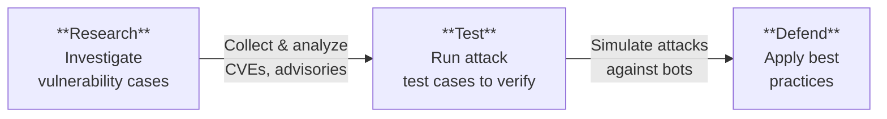

# AuditClaw Knowledge Base

## Using OpenClaw Securely

[OpenClaw](https://github.com/openclaw/openclaw) is a hugely popular open-source AI assistant with over 230K stars. It can run AI bots across WhatsApp, Telegram, Discord, Slack, and many other channels. However, **its power comes with significant security risks**.

### What's the Problem?

OpenClaw satisfies all conditions of the "Lethal Trifecta":

```
1. Has access to private data (API keys, conversation history)
2. Processes untrusted external data (messages, URLs, files)
3. Can communicate externally (multi-channel, webhooks, browser automation)
```

OpenClaw has **160+ published security advisories**, sandbox is disabled by default, and prompt injection defenses remain unimplemented.

---

## Purpose of This Knowledge Base

We take the approach of **"Know the attack to strengthen the defense"** to improve OpenClaw security.

### Three Pillars



### How We Work

| Step | Action | Deliverable |
|------|--------|-------------|
| **Step 1** | Research vulnerability cases from global sources | Case study collection |
| **Step 2** | Analyze applicability to OpenClaw | Impact analysis report |
| **Step 3** | Design attack test cases | Test procedure document |
| **Step 4** | Verify in test environment | Test results (PASS/FAIL) |
| **Step 5** | Compile best practices | Security guide |
| **Step 6** | Propose improvements to OpenClaw | PRs and Issues |

---

## Attack Categories

| Category | What Kind of Attack? | Risk Level |
|----------|---------------------|------------|
| [Prompt Injection](vulnerabilities/prompt-injection.md) | Rewrite AI instructions via messages | Highest |
| [Sandbox Escape](vulnerabilities/sandbox-escape.md) | Break out of container isolation to access host | High |
| [Dependency Vulnerabilities](vulnerabilities/dependency.md) | Exploit vulnerabilities in npm packages | High |
| [Authentication Bypass](vulnerabilities/auth-bypass.md) | Circumvent DM pairing, OAuth, etc. | High |
| [Data Leakage](vulnerabilities/data-leakage.md) | Leak API keys, conversation history | High |

---

## Current Progress

### Completed Research
- Prompt Injection: 8 major cases + OpenClaw status analysis
- OpenClaw official security posture: 160+ advisory analysis

### Next Steps
- Sandbox escape case research
- Best practice compilation based on OWASP Top 10 for LLM
- Prompt injection test case creation
