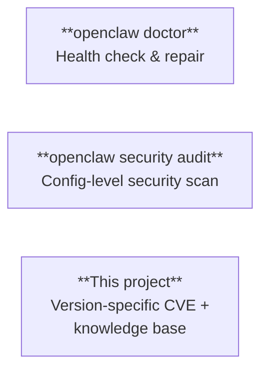
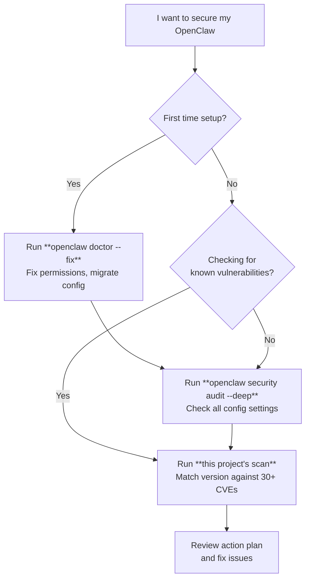

# Tool Comparison — Built-in vs This Project

OpenClaw provides built-in security commands. This page explains what they cover, what they don't, and where this project fills the gaps.

## Overview

These three are **complementary**, not competing. Use all of them.

## Coverage Matrix

### Vulnerability Detection

| Check Item | `doctor` | `security audit` | This project |
|---|:---:|:---:|:---:|
| Version-specific GHSA/CVE matching (30+) | | | **Yes** |
| CalVer-aware fixedIn comparison | | | **Yes** |
| Severity classification (Critical/High/Medium) | | | **Yes** |
| Vulnerability category breakdown (RCE, Auth Bypass, etc.) | | | **Yes** |
| NVD/CVE cross-reference links | | | **Yes** |
| Prompt injection detection | | Partial (flag only) | Warning |
| ClawHub skill code audit | | Shallow (pattern match) | Planned |

### Configuration Audit

| Check Item | `doctor` | `security audit` | This project |
|---|:---:|:---:|:---:|
| Sandbox enabled | | **Yes** | **Yes** (RC-001) |
| Gateway auth token set | Warning | **Yes** | **Yes** (RC-002) |
| Gateway bind = loopback | | **Yes** | **Yes** (RC-007) |
| DM pairing rate limit | | **Yes** | **Yes** (RC-003) |
| Exec allowlist restricted | | **Yes** | **Yes** (RC-004) |
| Webhook secret set | | **Yes** | **Yes** (RC-005) |
| Auto-update enabled | | | **Yes** (RC-006) |
| tools.deny configured | | **Yes** | Planned (RC-009) |
| File permissions (700/600) | **Yes** | **Yes** (--fix) | Planned (RC-008) |
| Token rotation status | | | Planned (RC-010) |
| Open DM policy | Warning | **Yes** | |
| Group policy (open → allowlist) | | **Yes** (--fix) | |
| Log redaction | | **Yes** (--fix) | |
| mDNS metadata leak | | **Yes** | |
| IP spoofing (allowRealIpFallback) | | **Yes** | |
| Plugin reachability | | **Yes** | |
| Small model + no sandbox | | **Yes** | |
| Session key override risk | | **Yes** | |

### Environment Health

| Check Item | `doctor` | `security audit` | This project |
|---|:---:|:---:|:---:|
| Legacy config migration | **Yes** (--fix) | | |
| Disk layout migration | **Yes** (--fix) | | |
| OAuth token refresh/expiry | **Yes** | | |
| Sandbox Docker image check | **Yes** | | |
| Port conflict detection | **Yes** | | |
| Supervisor (launchd/systemd) integrity | **Yes** (--deep) | | |
| State directory consistency | **Yes** | | |

### Auto-Fix Capabilities

| Fix | `doctor --fix` | `audit --fix` | This project |
|---|:---:|:---:|:---:|
| File permissions | **Yes** | **Yes** | No (guidance only) |
| Group policy enforcement | | **Yes** | |
| Log redaction setting | | **Yes** | |
| Legacy config migration | **Yes** | | |
| Gateway token generation | **Yes** | | |
| Config/setting changes | | | No (never modifies) |

### Reporting & Integration

| Feature | `doctor` | `security audit` | This project |
|---|:---:|:---:|:---:|
| Markdown report output | | | **Yes** |
| JSON output (CI/CD) | **Yes** | **Yes** | Planned |
| Skill format (run in chat) | | | **Yes** |
| Japanese language support | | | **Yes** |
| Knowledge base (research docs) | | | **Yes** |
| Action plan with priorities | | | **Yes** |
| Permanent warnings (cross-version) | | | **Yes** |

## When to Use What

### Recommended Order

1. **`openclaw doctor --fix`** — Fix environment health first
2. **`openclaw security audit --deep --fix`** — Harden configuration
3. **This project's scan** — Check version-specific vulnerabilities

## Mapping to Zenn Security Article (7 Measures)

Reference: [Komlock Lab — "OpenClawの魂が盗まれる？"](https://zenn.dev) (2026/02/18)

| # | Measure | Best Tool |
|---|---------|-----------|
| ① | Gateway bind = loopback | `security audit` **+ this project (RC-007)** |
| ② | Token rotation | `doctor --generate-gateway-token` |
| ③ | File permissions (700/600) | `doctor --fix` / `security audit --fix` |
| ④ | tools.deny restriction | `security audit` |
| ⑤ | ClawHub skill vetting | Manual review (no tool fully covers this yet) |
| ⑥ | Run security audit | `security audit --deep` |
| ⑦ | OS-level Infostealer defense | Outside scope of all tools |

## What Only This Project Does

1. **Version-specific GHSA/CVE mapping** — "Is version 2026.2.10 affected by GHSA-gv46-4xfq-jv58?" No other tool answers this.
2. **CalVer-aware comparison** — Correctly handles OpenClaw's `YYYY.M.D` versioning across 4 name changes.
3. **Japanese language support** — Only multilingual security tool in the OpenClaw ecosystem.
4. **Skill format** — Say "security scan" in chat. No CLI required.
5. **Knowledge base** — Curated research on vulnerability cases, attack patterns, and best practices.
6. **Permanent warnings** — Cross-version risks (prompt injection, DM brute-force) that no patch fixes.

## What This Project Does NOT Do

- **Never modifies your config** — Read-only. All fixes are guidance, not auto-applied.
- **No real-time monitoring** — Point-in-time scan only.
- **No penetration testing** — Does not send attack payloads.
- **No ClawHub skill deep audit** — Planned for Phase 2.
- **No file permission fixes** — Delegates to `openclaw doctor --fix`.
