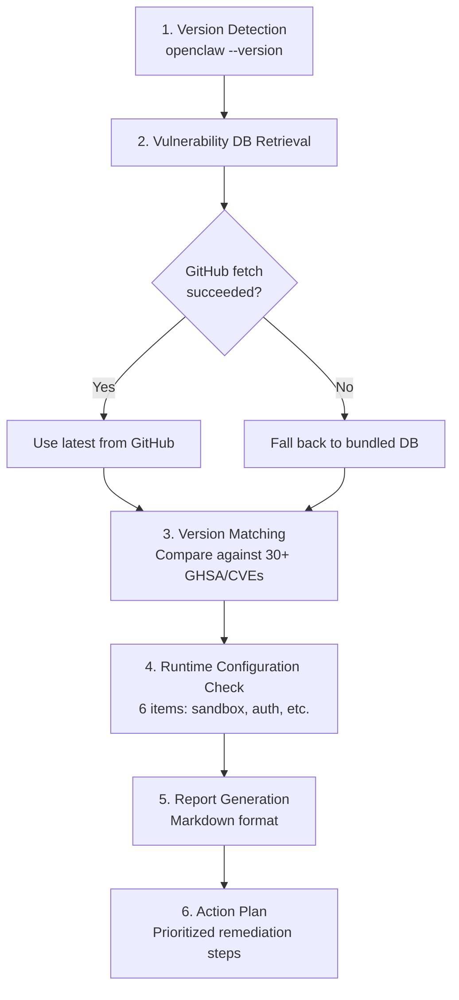

# Security Self-Scan

A self-diagnostic security skill that can be embedded into OpenClaw. Just say "security scan" to automatically identify vulnerabilities and configuration issues for your version.

## Capabilities

| Feature | Description |
|---------|-------------|
| Version vulnerability check | Matches against 30+ known GHSA/CVEs |
| Runtime configuration check | Verifies 6 items including sandbox, Gateway auth |
| Action plan | Auto-generates prioritized remediation steps |
| Hybrid DB | Fetches latest from GitHub, falls back to bundled version |

## Installation

### Option 1: Copy from Repository

```bash
# Clone this repository
git clone https://github.com/natsuki/openclaw-security.git

# Copy skill directory to your OpenClaw skills folder
cp -r openclaw-security/skill-dist/openclaw-security-scan /path/to/openclaw/skills/
```

### Option 2: Direct Download

```bash
# Download skill files directly
mkdir -p skills/openclaw-security-scan
curl -sL https://raw.githubusercontent.com/natsuki/openclaw-security/main/skill-dist/openclaw-security-scan/SKILL.md -o skills/openclaw-security-scan/SKILL.md
curl -sL https://raw.githubusercontent.com/natsuki/openclaw-security/main/skill-dist/openclaw-security-scan/scan.sh -o skills/openclaw-security-scan/scan.sh
curl -sL https://raw.githubusercontent.com/natsuki/openclaw-security/main/skill-dist/openclaw-security-scan/vulnerability-db.json -o skills/openclaw-security-scan/vulnerability-db.json
chmod +x skills/openclaw-security-scan/scan.sh
```

## Usage

### In OpenClaw Chat

Simply say one of the following to automatically trigger a scan:

- "security scan"
- "security check"
- "vulnerability check"
- "is my version safe?"

### Direct CLI

```bash
# Scan with a specific version
bash scan.sh 2026.2.10

# Output example (Markdown report):
# # OpenClaw Security Scan Results
# | Severity | Count |
# |----------|-------|
# | Critical | 1 |
# | High | 20 |
# ...
```

## Scan Flow



## Check Items

### Vulnerability Categories

| Category | Representative Vulnerabilities |
|----------|-------------------------------|
| RCE | Gateway approval bypass, WebSocket config.apply |
| Authentication Bypass | Telegram webhook, Canvas auth, Slack callback |
| Sandbox Escape | Symlink, hard link |
| Path Traversal | Plugin install, browser upload |
| Command Injection | Docker PATH, sshNodeCommand |
| Exec Allowlist Bypass | GNU long option, env -S |

### Runtime Configuration Checks

| Item | Recommended Setting |
|------|-------------------|
| Sandbox | `openclaw config set sandbox all` |
| Gateway Auth | Configure authentication token |
| DM Rate Limit | Enable rate limiting |
| Exec Allowlist | Allow only minimum required commands |
| Webhook Secret | Configure secret on all endpoints |
| Auto-Update | Enable |

## Vulnerability DB Updates

The vulnerability database is managed in the [openclaw-security repository](https://github.com/natsuki/openclaw-security). The latest version is automatically fetched from GitHub during scan execution; when offline, the bundled version is used.

DB update triggers:
- New OpenClaw security advisory published
- Version release

## Comparison with Other Tools

| Tool | Version-specific CVE | Config Check | Skill Format |
|------|:---:|:---:|:---:|
| **This skill** | Yes | Yes | Yes |
| `openclaw security audit` | No | Yes | No |
| SecureClaw | No | Yes | No |
| ClawSec | Partial (feed) | No | No |

The unique value of this skill is providing **version-specific vulnerability checking with full GHSA/CVE mapping** in a skill format.
