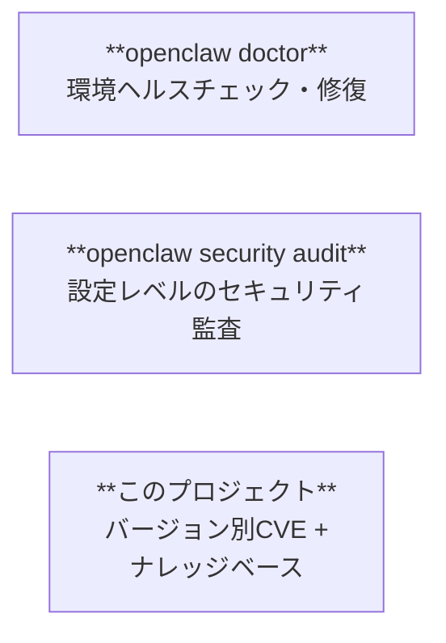
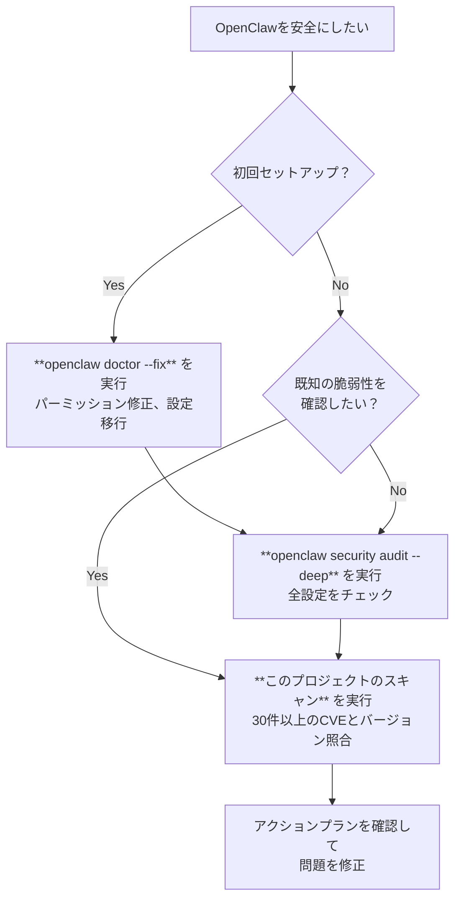

# ツール比較 — 標準コマンド vs このプロジェクト

OpenClawにはセキュリティ関連の標準コマンドがあります。このページでは、それらが何をカバーし、何をカバーしないか、そしてこのプロジェクトがどこを補完するかを説明します。

## 全体像

この3つは**競合ではなく補完関係**です。すべて使ってください。

## カバレッジ対照表

### 脆弱性検出

| チェック項目 | `doctor` | `security audit` | このプロジェクト |
|---|:---:|:---:|:---:|
| バージョン別GHSA/CVEマッチング（30件以上） | | | **対応** |
| CalVer対応のfixedIn比較 | | | **対応** |
| 深刻度分類（Critical/High/Medium） | | | **対応** |
| 脆弱性カテゴリ別分類（RCE, 認証バイパス等） | | | **対応** |
| NVD/CVEクロスリファレンスリンク | | | **対応** |
| プロンプトインジェクション検出 | | 部分的（フラグのみ） | 警告 |
| ClawHubスキルのコード監査 | | 浅い（パターンマッチ） | 計画中 |

### 設定監査

| チェック項目 | `doctor` | `security audit` | このプロジェクト |
|---|:---:|:---:|:---:|
| サンドボックス有効化 | | **対応** | **対応** (RC-001) |
| Gatewayの認証トークン設定 | 警告 | **対応** | **対応** (RC-002) |
| Gateway bind = loopback | | **対応** | **対応** (RC-007) |
| DMペアリングのレート制限 | | **対応** | **対応** (RC-003) |
| exec allowlist制限 | | **対応** | **対応** (RC-004) |
| Webhookシークレット設定 | | **対応** | **対応** (RC-005) |
| 自動アップデート有効化 | | | **対応** (RC-006) |
| tools.deny設定 | | **対応** | 計画中 (RC-009) |
| ファイルパーミッション（700/600） | **対応** | **対応** (--fix) | 計画中 (RC-008) |
| トークンローテーション状況 | | | 計画中 (RC-010) |
| オープンDMポリシー | 警告 | **対応** | |
| グループポリシー（open → allowlist） | | **対応** (--fix) | |
| ログ秘匿化 | | **対応** (--fix) | |
| mDNSメタデータ漏洩 | | **対応** | |
| IP偽装（allowRealIpFallback） | | **対応** | |
| プラグイン到達性 | | **対応** | |
| 小モデル+サンドボックスなし | | **対応** | |
| セッションキーオーバーライドリスク | | **対応** | |

### 環境ヘルス

| チェック項目 | `doctor` | `security audit` | このプロジェクト |
|---|:---:|:---:|:---:|
| レガシー設定の移行 | **対応** (--fix) | | |
| ディスクレイアウトの移行 | **対応** (--fix) | | |
| OAuthトークン更新・有効期限 | **対応** | | |
| サンドボックスDockerイメージ確認 | **対応** | | |
| ポート衝突検出 | **対応** | | |
| Supervisor（launchd/systemd）整合性 | **対応** (--deep) | | |
| ステートディレクトリ整合性 | **対応** | | |

### 自動修正

| 修正内容 | `doctor --fix` | `audit --fix` | このプロジェクト |
|---|:---:|:---:|:---:|
| ファイルパーミッション | **対応** | **対応** | なし（案内のみ） |
| グループポリシー強制 | | **対応** | |
| ログ秘匿化設定 | | **対応** | |
| レガシー設定の移行 | **対応** | | |
| Gatewayトークン生成 | **対応** | | |
| 設定・構成の変更 | | | なし（一切変更しない） |

### レポート・連携

| 機能 | `doctor` | `security audit` | このプロジェクト |
|---|:---:|:---:|:---:|
| Markdownレポート出力 | | | **対応** |
| JSON出力（CI/CD連携） | **対応** | **対応** | 計画中 |
| スキル形式（チャットで実行） | | | **対応** |
| 日本語対応 | | | **対応** |
| ナレッジベース（調査ドキュメント） | | | **対応** |
| 優先度付きアクションプラン | | | **対応** |
| 永続的警告（全バージョン共通） | | | **対応** |

## いつ何を使うか

### 推奨実行順序

1. **`openclaw doctor --fix`** — まず環境の健全性を修復
2. **`openclaw security audit --deep --fix`** — 設定をハードニング
3. **このプロジェクトのスキャン** — バージョン固有の脆弱性をチェック

## Zenn記事のセキュリティ対策7選との対応

参考: [Komlock Lab — 「OpenClawの"魂"が盗まれる？」](https://zenn.dev) (2026/02/18)

| # | 対策 | 最適なツール |
|---|------|------------|
| ① | gateway.bind = loopback | `security audit` **+ このプロジェクト (RC-007)** |
| ② | トークンローテーション | `doctor --generate-gateway-token` |
| ③ | ファイルパーミッション（700/600） | `doctor --fix` / `security audit --fix` |
| ④ | tools.deny制限 | `security audit` |
| ⑤ | ClawHubスキルの審査 | 手動確認（完全にカバーするツールはまだない） |
| ⑥ | security auditの実行 | `security audit --deep` |
| ⑦ | OS層のInfostealer対策 | 全ツールの対象外 |

## このプロジェクトだけができること

1. **バージョン別GHSA/CVEマッピング** — 「バージョン2026.2.10はGHSA-gv46-4xfq-jv58の影響を受ける？」に答えられるのはこのツールだけ
2. **CalVer対応の比較** — OpenClawの`YYYY.M.D`形式と4回の名前変更を正しく処理
3. **日本語対応** — OpenClawエコシステム唯一の多言語セキュリティツール
4. **スキル形式** — チャットで「セキュリティスキャン」と言うだけ。CLIは不要
5. **ナレッジベース** — 脆弱性事例、攻撃パターン、ベストプラクティスの調査ドキュメント集
6. **永続的警告** — パッチでは直らないバージョン横断的リスク（プロンプトインジェクション、DMブルートフォース）

## このプロジェクトがやらないこと

- **設定を一切変更しない** — 読み取り専用。修正はすべてガイダンスとして提示
- **リアルタイム監視なし** — ポイントインタイムのスキャンのみ
- **ペネトレーションテストなし** — 攻撃ペイロードは送信しない
- **ClawHubスキルの深掘り監査なし** — Phase 2で計画中
- **ファイルパーミッション修正なし** — `openclaw doctor --fix` に委任
