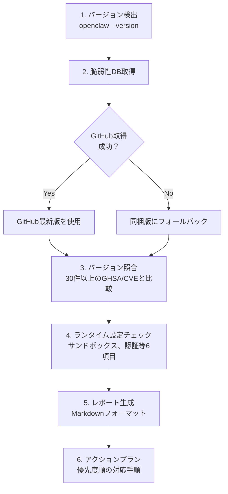

# セキュリティセルフスキャン

OpenClawに組み込めるセキュリティ自己診断スキルです。「セキュリティスキャン」と言うだけで、使用中のバージョンの脆弱性と設定上の問題を自動的に洗い出します。

## できること

| 機能 | 説明 |
|------|------|
| バージョン脆弱性チェック | 30件以上の既知GHSA/CVEと照合 |
| ランタイム設定チェック | サンドボックス、Gateway認証等の6項目を確認 |
| アクションプラン | 優先度順の対応手順を自動生成 |
| ハイブリッドDB | GitHubから最新版を取得、失敗時は同梱版を使用 |

## インストール方法

### 方法1: リポジトリからコピー

```bash
# このリポジトリをクローン
git clone https://github.com/natsuki/openclaw-security.git

# スキルディレクトリをOpenClawのスキルフォルダにコピー
cp -r openclaw-security/skill-dist/openclaw-security-scan /path/to/openclaw/skills/
```

### 方法2: 直接ダウンロード

```bash
# スキルファイルを直接ダウンロード
mkdir -p skills/openclaw-security-scan
curl -sL https://raw.githubusercontent.com/natsuki/openclaw-security/main/skill-dist/openclaw-security-scan/SKILL.md -o skills/openclaw-security-scan/SKILL.md
curl -sL https://raw.githubusercontent.com/natsuki/openclaw-security/main/skill-dist/openclaw-security-scan/scan.sh -o skills/openclaw-security-scan/scan.sh
curl -sL https://raw.githubusercontent.com/natsuki/openclaw-security/main/skill-dist/openclaw-security-scan/vulnerability-db.json -o skills/openclaw-security-scan/vulnerability-db.json
chmod +x skills/openclaw-security-scan/scan.sh
```

## 使い方

### OpenClawのチャットで

以下のように話しかけるだけで自動的にスキャンが実行されます:

- 「セキュリティスキャン」
- 「セキュリティチェック」
- 「脆弱性チェック」
- 「自分のバージョンは安全？」

### CLIで直接

```bash
# バージョンを指定してスキャン
bash scan.sh 2026.2.10

# 出力例（Markdownレポート）:
# # OpenClaw セキュリティスキャン結果
# | 深刻度 | 件数 |
# |--------|------|
# | Critical | 1件 |
# | High | 20件 |
# ...
```

## スキャンの流れ



## チェック項目一覧

### 脆弱性カテゴリ

| カテゴリ | 代表的な脆弱性 |
|---------|---------------|
| RCE | Gateway承認バイパス、WebSocket config.apply |
| 認証バイパス | Telegram webhook、Canvas認証、Slack callback |
| サンドボックスエスケープ | シンボリックリンク、ハードリンク |
| パストラバーサル | プラグインインストール、ブラウザアップロード |
| コマンドインジェクション | Docker PATH、sshNodeCommand |
| exec allowlistバイパス | GNUロングオプション、env -S |

### ランタイム設定チェック

| 項目 | 推奨設定 |
|------|---------|
| サンドボックス | `openclaw config set sandbox all` |
| Gateway認証 | 認証トークンを設定 |
| DMレート制限 | レート制限を有効化 |
| exec許可リスト | 最小限のコマンドのみ許可 |
| Webhookシークレット | 全エンドポイントにシークレット設定 |
| 自動アップデート | 有効化推奨 |

## 脆弱性DBの更新

脆弱性データベースは [openclaw-security リポジトリ](https://github.com/natsuki/openclaw-security) で管理されています。スキャン実行時にGitHubから最新版を自動取得しますが、ネットワーク不可時は同梱版が使用されます。

DB更新のタイミング:
- OpenClawの新しいセキュリティアドバイザリ公開時
- バージョンリリース時

## 他ツールとの比較

| ツール | バージョン別CVE | 設定チェック | スキル形式 |
|--------|:-:|:-:|:-:|
| **このスキル** | ○ | ○ | ○ |
| `openclaw security audit` | × | ○ | × |
| SecureClaw | × | ○ | × |
| ClawSec | △（フィード） | × | × |

このスキルのユニークな価値は**全GHSA/CVEマッピングを持つバージョン別脆弱性チェック**をスキル形式で提供している点です。
