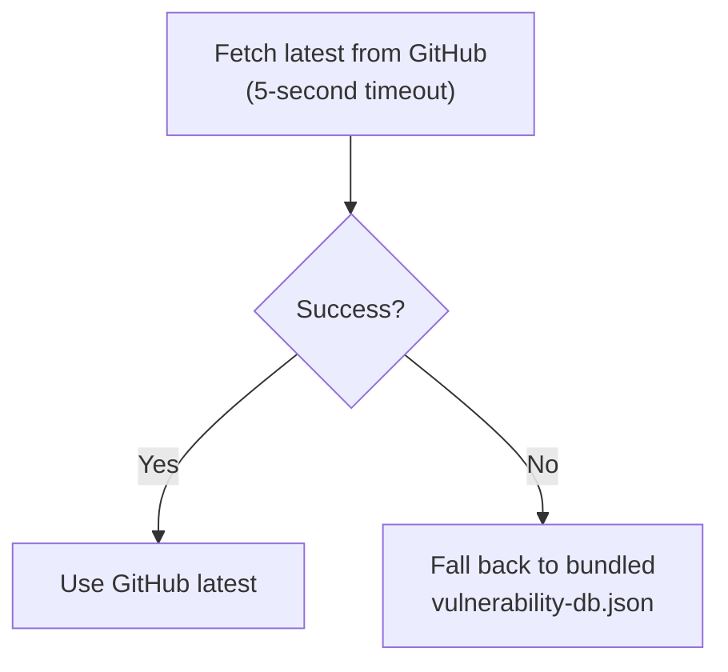

# AuditClaw Scan Skill

A self-diagnostic security skill for identifying known vulnerabilities and runtime configuration issues in OpenClaw.

## Features

- **Version-specific vulnerability check**: Identify vulnerabilities affecting your OpenClaw version
- **Runtime configuration check**: Verify sandbox, Gateway auth, and other settings (6 items)
- **Hybrid DB retrieval**: Fetches latest from GitHub, falls back to bundled version
- **Action plan**: Prioritized remediation steps

## Prerequisites

- Node.js >= 18 (used for JSON parsing and version comparison)
- curl (used for GitHub DB fetch; works without it)

## Usage

### As an OpenClaw Skill

1. Copy this directory to your OpenClaw skills folder
2. Say "security scan" in chat

### Direct CLI Execution

```bash
# Scan with a specific version
bash scan.sh 2026.2.10

# Scan with a custom DB path
bash scan.sh 2026.2.10 /path/to/vulnerability-db.json
```

## File Structure

| File | Description |
|------|-------------|
| `SKILL.md` | OpenClaw skill definition (6 phases + behavioral rules) |
| `scan.sh` | Scan execution script |
| `vulnerability-db.json` | Bundled vulnerability database |
| `README.md` | This file |

## Vulnerability Database

`vulnerability-db.json` contains:

- **vulnerabilities**: GHSA/CVE entries (30+)
- **runtimeChecks**: Runtime configuration check items
- **permanentWarnings**: Warnings common to all versions

The database is maintained in the [auditclaw repository](https://github.com/natsuki/auditclaw).

## DB Retrieval Flow



## Output Example

```
# AuditClaw Scan Results

| Item | Value |
|------|-------|
| Scan date | 2026-02-28 |
| Target version | 2026.2.10 |
| Latest version | 2026.2.26 |

## Summary

| Severity | Count |
|----------|-------|
| Critical | 1 |
| High | 20 |
| Medium | 2 |
...
```

## Vulnerability Categories

| Category | Representative Vulnerabilities |
|----------|-------------------------------|
| RCE | Gateway approval bypass, WebSocket config.apply |
| Authentication Bypass | Telegram webhook, Canvas auth, Slack callback |
| Sandbox Escape | Symlink, hard link |
| Path Traversal | Plugin install, browser upload |
| Command Injection | Docker PATH, sshNodeCommand |
| Exec Allowlist Bypass | GNU long option, env -S |

## Runtime Configuration Checks

| Item | Recommended Setting |
|------|-------------------|
| Sandbox | `openclaw config set sandbox all` |
| Gateway Auth | Configure authentication token |
| DM Rate Limit | Enable rate limiting |
| Exec Allowlist | Allow only minimum required commands |
| Webhook Secret | Configure secret on all endpoints |
| Auto-Update | Enable |

## DB Updates

The vulnerability database is managed in the [auditclaw repository](https://github.com/natsuki/auditclaw). During scan execution, the latest version is automatically fetched from GitHub; when offline, the bundled version is used.

DB update triggers:
- New OpenClaw security advisory published
- Version release

## Comparison with Other Tools

| Tool | Version-specific CVE | Config Check | Skill Format |
|------|:---:|:---:|:---:|
| **This skill** | Yes | Yes | Yes |
| `openclaw security audit` | No | Yes | No |
| SecureClaw | No | Yes | No |
| ClawSec | Partial (feed) | No | No |

The unique value of this skill is providing **version-specific vulnerability checking with full GHSA/CVE mapping** in a skill format.

For a detailed coverage matrix, see [Tool Comparison — Built-in vs This Project](../../docs/en/comparison.md).

## License

MIT
